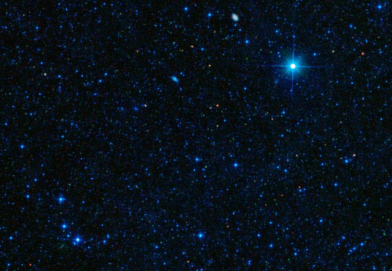
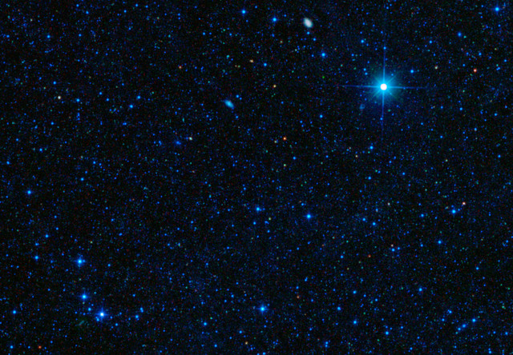

## Benchmarking image thumbnail generation in PHP 8
#### Original benchmark script from https://robertvicol.com/tech/imagemagick-vs-gd-benchmark-resize-image-in-php-script/

We are testing on PHP8 this libraries:
- php8.0-imagick
- php8.0-gd
- php8.0-vips

They say on GD vs Imagick, Imagick always is faster. Not on my machine. CPU i7-4702MQ.

Benchmark results: (image quality set to 90)

- ImageMagick took: 0.37198996543884 seconds. 103 KB.
- GD took: 0.29470610618591 seconds. 164 KB.
- VIPS took: 0.083019018173218 seconds. 53 KB.

Example images:

Original

ImageMagick

GD

VIPS

